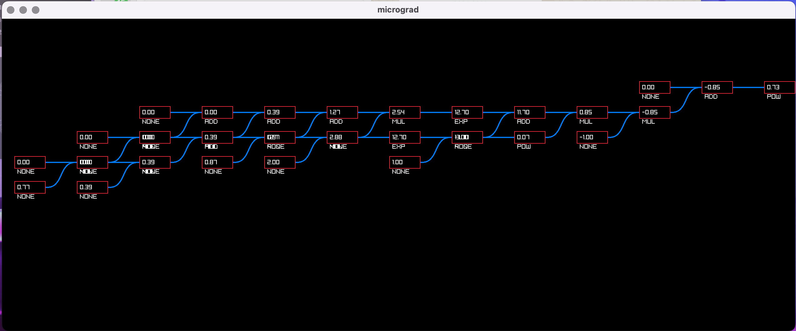

# Micrograd
Implementation of Karpathy's micrograd in C

___

## Overview
Micrograd is a lightweight implementation of automatic differentiation (autograd) in C, inspired by Andrej Karpathy's Micrograd. The project provides a foundation for building and training neural networks with custom gradients.

## Features
- **Autograd:** Supports basic operations such as addition, subtraction, multiplication, exponentiation, and power. Implemented in `engine.h` and `engine.c`.
- **Activation Functions:** Sigmoid and Tanh activation functions are currently implemented.
- **Neural Networks:** 
  - Multi-layer perceptron networks (MLP) with forward and backward passes.
  - Mean Squared Error (MSE) loss function.
  - Stochastic Gradient Descent (SGD) optimizer.
  - Implemented in `nn.h`.
- **Computational Graph Vizualization:**


  - Implented in `viz.h` the project also includes a simple computational graph vizualization using `raylib`.
  - This future is still in development and contains bugs in current form.
  
## TODO
- [ ] Implementation of softmax() and relu() activations.
- [X] Autograd for `log` and `ln` operations
- [ ] Cross Entropy Loss

## Getting Started
### Prerequisites
- A C compiler (e.g., GCC)
- raylib
- Makefile for building the project (optional)

### Building the Project
To build the project, run:
```sh
cd src
make
./main
